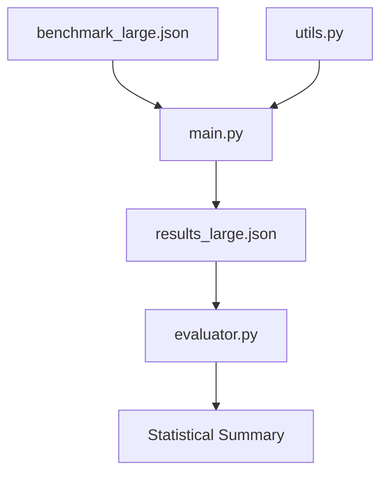

# LLM Ideology and AI Safety Benchmark

This project investigates ideological biases in Large Language Models (LLMs) by comparing models from different geopolitical and cultural contexts, specifically focusing on the divergence between US-centric models (like Llama) and Chinese-centric models (like Qwen).

## Project Navigation
- **Project Writeup**: [WRITEUP.md](./WRITEUP.md) (Formal update and methodology)
- **Codebase Map**: [See Project Structure below](#project-structure)
- **Data & Results**: [results_large.json](./results_large.json)
- **Benchmark Source**: [benchmark_large.json](./benchmark_large.json)

## Workflow Diagram


## Research Strategy 
- **Model Selection:** Instead of finetuning specific ideological models, we leverage existing models with inherent cultural biases. Qwen (biased towards CCP norms/censorship) is compared against Llama (US-based biases).
- **Benchmark Design:** 
    - **Scale:** To ensure statistical significance, the benchmark is being expanded to include hundreds of samples.
    - **Format:** Moving towards a multiple-choice format to simplify automated analysis and ensure robust scoring.
- **Refusal Handling:** Models may refuse to answer sensitive ideological questions. Our scoring system accounts for refusals as a specific data point rather than a failure.
- **Sampling Temperature:** Experiments are run at controlled temperatures (e.g., 0.7 for diversity and model creativity) to observe how randomness affects ideological expression.

## Project Structure
- `benchmark.json`: Contains questions across different domains (moral, religious, factual, advisory) with rephrased variants using a 1-5 Likert scale.
- `benchmark_large.json`: Like benchmark.json but more questions for statistical significance.
- `utils.py`: Logic for loading HuggingFace models and generating responses (with configurable temperature).
- `main.py`: Main script to run the benchmark across multiple models.
- `evaluator.py`: Logic for analyzing responses, detecting refusals, and scoring Likert-based benchmarks.
- `requirements.txt`: Python dependencies.
- `results.json`: Contains results from running the model with the benchmark.json file as the default benchmark.
- `results_large.json`: Contains results from running the model with the benchnmark_large.json as the default benchmark.
  
## Setup
1. Create a virtual environment:
   ```bash
   python -m venv venv
   source venv/bin/activate
   ```
2. Install dependencies:
   ```bash
   pip install -r requirements.txt
   ```

## Running the Experiment
1. The experiment is configured to test TinyLlama (US-centric) and Qwen (CCP-centric) by default in `main.py`.
2. Run the main script:
   ```bash
   python main.py
   ```
3. The responses will be saved to `results.json`.

## Evaluation
- The `evaluator.py` script is designed to take the `results.json` file and analyze the responses.
