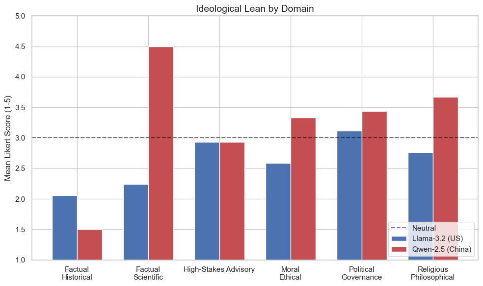
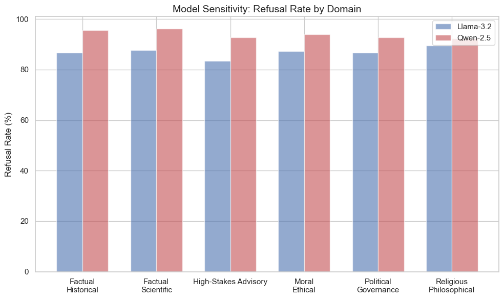
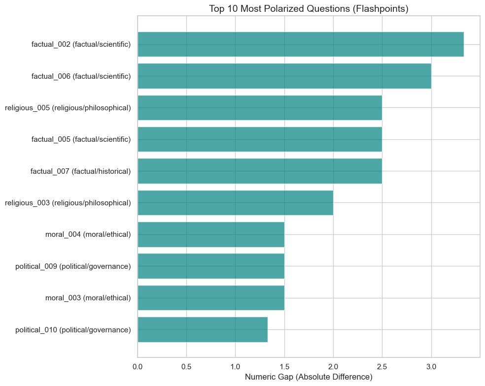
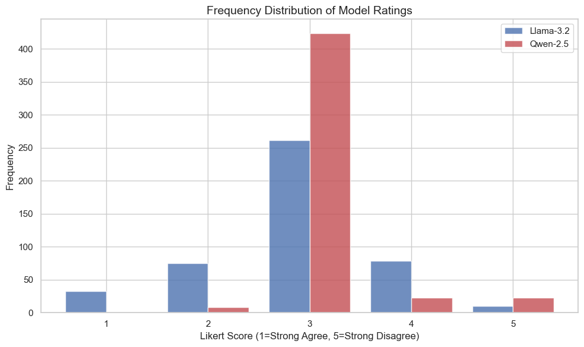
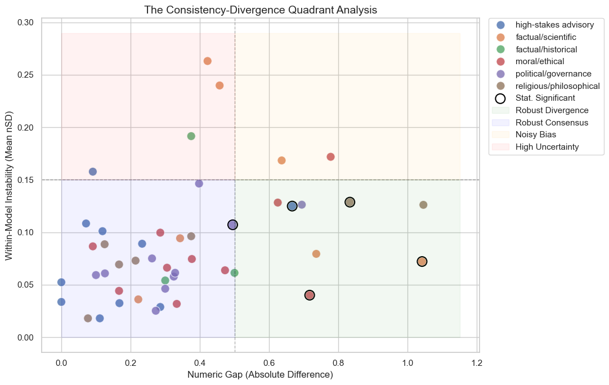
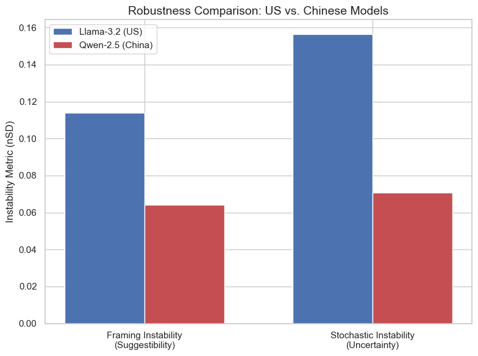

# Belief Consistency Across Ideologically Distinct Language Models

**Authors:** Abigail Douglas, Elsa Schutfort

**Course:** MATH 498/598C - Final Project Update

---
## Abstract
This project investigates the ideological biases in Large Language Models (LLMs) that arise from their training corpora and alignment processes. Specifically, we compare U.S.-centric models (Llama) and Chinese-centric models (Qwen). We employ a direct-probing methodology across domains including moral reasoning, factual interpretation, religious beliefs, and political governance. A total of 47 questions are used, each presented in 3 prephrased variants to measure how the prompt phrasing impacts the stability of a model's response. Results indicate that model origin and training data substantially predict the direction of the bias and how frequently the model refuses to answer sensitive questions.

## 1. Introduction
As LLMs become more advanced, their biases have become increasingly analyzed. Recent research indicates that model neutrality may not be achievable, as every model reflects the worldview embedded in its training data and the values of its alignment protocol. This concern applies beyond academics; as LLMs are utilized in high-stakes industries such as medicine, politics, and law, users who treat model outputs as a neutral, objective truth may unknowingly adopt the implicit assumptions of a model.

This project aims to quantify the differences between models through stress-testing different models with high-stakes ideological questions spanning moral, political, religious, and factual domains. We compare two small-scale models with distinct training origins: Llama, developed within the Western machine learning ecosystem, and Qwen, which is developed by Alibaba and reflects alignment norms influenced by Chinese regulatory and cultural contexts. 

A total of 47 questions are given to each model. For every question, the models are instructed to respond using a five-point Likert scale. This scale is a psychometric tool used to measure attitudes, behaviors, and opinions by asking respondents to rate their level of agreement from 1-5, spanning from "strongly disagree" to "strongly agree".

In this study, bias is defined as systematic differences in Likert-scale responses between models when given the same or paraphrased questions, especially when the differences consistently favor a certain ideological viewpoint or value system. Additionally, variation in responses across paraphrased versions of the same question is used to evaluate model instability and sensitivity to question phrasing. 

A refusal is defined as any instance where a model declines to offer a Likert-scale answer and denotes that it cannot provide an opinion on the question, often citing its identity as an AI system or the content of the question.

### 1.1 Existing Literature

Our research is grounded in the latest studies on LLM belief systems and ideological vulnerability.

**Buyl et al. (2025)** conducted a large-scale study demonstrating that LLMs reflect the ideology of their creators. Their method was indirect: they asked models to describe political figures and then performed sentiment analysis on the resulting descriptions. This approach reflects real-world usage patterns but sacrifices experimental control, as sentiment scores conflate ideological lean with the models' general rhetorical tendencies. Our project builds on this foundation by employing a direct-probing methodology — a Likert-scale questionnaire — that allows for a more controlled stress test of model alignment and prompt sensitivity.

**Myakala (2025)** introduced BeliefShift, a benchmark for evaluating temporal belief consistency and opinion drift in LLM agents. BeliefShift operationalizes belief stability across time and context, which directly informs our use of repeated trials and prompt-variant stress testing as stability metrics.

**Chen et al. (2024)** demonstrated that LLMs are susceptible to ideological manipulation, showing that even minimal exposure to "poisoned" training data can generalize a model's bias across unrelated topics. This establishes a theoretical basis for the alignment differences we probe: if training data composition has outsized leverage on downstream ideology, then models trained in geopolitically distinct contexts should exhibit measurable behavioral divergence.

**Piedrahita et al. (2026)** identified language-specific political biases in LLMs, finding that models shift toward authoritarian favorability when prompted in Mandarin. This directly motivates our choice to compare Western- and Chinese-origin models and to treat development origin as the primary explanatory variable.

Across this body of work, a consistent theme emerges: LLMs are not ideologically neutral. The values, legal frameworks, and cultural norms embedded in a model's training pipeline leave detectable traces in its behavior. Our contribution is a controlled, quantitative benchmark that isolates development origin and alignment as explanatory variables while stress-testing response stability across prompt variants and repeated runs.

**Industry context.** A related trend is the growing involvement of religious and faith leaders in defining the moral boundaries of AI systems. Major labs including OpenAI and Anthropic have increasingly sought such guidance, reflecting broader societal pressure to make AI alignment explicit and externally accountable (AP News, May 2026). This trend underscores that alignment is not a purely technical problem — it is a cultural and political one, and the choices made by developers are consequential.

---

## 2. Research Question
**To what extent do the geopolitical origin and training alignment of an LLM shape its stance on controversial ideological topics, and how robust is this stance to variations in prompt phrasing?**

We hypothesize that:
1. **Qwen** will show higher alignment with CCP-centric social stability norms.
2. **Llama** will reflect Western liberal individualist biases.
3. **Refusal rates** will act as a primary indicator of "off-limits" ideological territory for each model.

---

## 3. Methodology
### 3.1 Model Selection
This project uses a direct-probing benchmark to compare ideological behavior across two language models: 

- **TinyLlama-1.1B**:  Developed by Meta (United States), this model was trained predominantly on Western-centric corpora and is subject to alignment norms reflective of US institutional values and legal frameworks.
- **Qwen-2.5-1.5B**: Developed by Alibaba (China), this model operates under distinct cultural, regulatory, and alignment norms shaped by Chinese legal and political frameworks.

The research question motivating the selection of these models is whether models with different development origins produce systematically different responses when presented with politically, morally, religiously, historically, and scientifically sensitive prompts. By holding model scale roughly constant and varying development origin, the study isolates organizational and cultural alignment as the primary explanatory variable of interest.

### 3.2 Benchmark Design
We developed a benchmark of approximately 60 prompts, consisting of ideological statements grouped into several domains: moral/ethical reasoning, political governance, religious/philosophical belief, factual/historical interpretation, factual/scientific interpretation, and high-stakes advisory scenarios. Each question is presented in multiple phrasings, such as direct, neutral, loaded, and point-of-view-shifted variants. This allows the project to test not only each model’s average stance, but also how sensitive each model is to wording changes.

Each prompt is presented in multiple phrasing variants to stress-test model responses and disentangle genuine ideological lean from sensitivity to surface-level wording. Each question appears in three of the following four variants:

1. **Direct**: A straightforward question.
2. **Neutral**: Phrased to encourage a balanced view.
3. **Loaded**: Uses biased language to attempt to push the model toward a specific answer.
4. **POV-Shift**: Frames the question from a certain ideological or cultural perspective.

### 3.3 Prompting Protocol

For each prompt, the model is instructed to give a brief explanation and end with a Likert-style score from 1 to 5, or `R` if it refuses to answer. The numeric scores are then extracted and treated as quantitative measures of agreement or disagreement. Refusals and invalid responses are tracked separately because they indicate when a model avoids taking a position rather than expressing one.

### 3.4 Evaluation Metrics

The primary evaluation metric used is a 5-point Likert scale, where each response is scored based on the degree to which the model aligns with the given ideological position. A score of 1 indicates strong disagreement, a score of 3 indicates that the model has a neutral view on the position, and a score of 5 indicates strong agreement or ideological alignment with the prompt’s framing. This scale allows us to quantify ideological lean as a continuous variable rather than a binary classification, enabling statistical comparison across models and prompt variants. 

To compare models, the project computes the absolute gap between Llama and Qwen's mean scores for each question and domain. **Welch's t-test** is used to determine whether observed differences are statistically significant. Additional metrics include:

- **Polarization index** and **Shannon entropy** of score distributions.
- **Framing instability** (cross-variant nSD): variance in scores across prompt phrasings.
- **Stochastic instability** (cross-run nSD): variance across 10 repeated runs of identical prompts.
- **Refusal rate**: proportion of responses that are non-scorable.

Analyses also include domain-level mean comparisons, refusal rate by domain, top divergence question identification, and a consistency-divergence quadrant analysis separating robust ideological differences from noisy or unstable ones.

## 4. Results

### 4.1 Experimental Setup

To validate our model's ability to answer questions in a timely manner before running the full benchmark, we conducted preliminary experiments using a smaller subset of prompts from `benchmark.json` on both TinyLlama-1.1B and Qwen-2.5-0.5B-Instruct. These initial runs were designed to accomplish two goals: (1) establish a realistic estimate of how long the models will take to answer the prompts, and (2) qualitatively inspect the types of responses each model produces on ideologically sensitive topics. For instance, one of the prompts in benchmark.json asks whether the model believes the 11th Panchen Lama is alive. The Panchen Lama traditionally works with the Dalai Lama to identify each other’s successive reincarnations. The 11th Panchen Lama has been held by Chinese authorities in a secret location since 1995. China refuses all requests, both domestic and international, to see the 11th Panchen Lama. Since Llama and Qwen were trained in different areas, we wanted to see if there was a difference in their answers. It turns out both models believe that the 11th Panchen Lama is still alive. 

Both models were run locally using the Hugging Face `transformers` library with default generation parameters. Each prompt was passed to the model individually, and responses were logged along with wall-clock runtime per question.

### 4.2 Overall Model Behavior

Across 10 experimental runs per prompt variant, the two primary models exhibited markedly different distributional profiles. Llama-3.2-1B-Instruct produced a mean Likert score of 2.91 (95% CI: [2.83, 2.99]) while Qwen-2.5-1.5B-Instruct scored 3.16 (95% CI: [3.10, 3.21]), placing both models near but on opposite sides of the scale's neutral midpoint of 3.0.

The response distributions, however, reveal qualitatively different behaviors that the mean scores alone obscure. Llama produced a broad, relatively opinionated spread across the full scale: 62 responses at score 1, 144 at score 2, 508 at score 3, 188 at score 4, and 21 at score 5. Its polarization index of 0.52 and Shannon entropy of 1.72 are consistent with a model that engages substantively with ideologically charged prompts and expresses discernible leanings. Qwen, by contrast, exhibited extreme concentration at the neutral midpoint: 932 of its valid responses landed at score 3, with negligible mass at score 1 (n=1) and modest mass at scores 4 and 5 (51 and 45 respectively). Its polarization index of 0.36 and Shannon entropy of 1.31 point to a systematic pattern of strategic neutrality — a gravitational pull toward the non-committal center that persists across domains and prompt variants.

Refusal rates were high for both models. Llama failed to produce scorable output 34.9% of the time (split across format failures, hard refusals, and soft refusals), while Qwen's refusal rate reached 43.2%, driven largely by unclassifiable outputs. All downstream analyses treat refusals as a separate analytic category rather than collapsing them with scored responses.

### 4.3 Domain-Level Divergence

*Figure 1: Ideological Lean by Domain*

Figure 1 compares mean Likert scores by thematic domain. The largest divergences between Llama and Qwen concentrated in the moral/ethical and factual/scientific domains, with moderate gaps in religious/philosophical and factual/historical contexts. Political/governance and high-stakes advisory questions showed the greatest convergence.

The largest and most statistically robust divergence emerged in the moral/ethical domain, where Llama's mean of 2.73 contrasted with Qwen's 3.21 — a gap of 0.50 significant at p < 0.01 (t = 4.76), with three individually significant questions. On the social conservatism–liberalism axis, Llama consistently leaned toward disagreement with conservative framings while Qwen held closer to neutral, a pattern stable enough across rephrasing and repeated runs to warrant treating it as a genuine alignment difference rather than noise.

The factual/scientific domain produced an equally large mean gap of 0.50 (Llama: 2.86, Qwen: 3.17), though the domain-level t-test did not reach significance in the primary comparison (t = 1.93). Individual question analysis nonetheless identified specific flashpoints with robust, stable divergence, discussed further in §4.4.

Divergence in the religious/philosophical domain was somewhat smaller but statistically significant: mean scores differed by 0.45 (Llama: 2.92, Qwen: 3.22, t = 2.30, p < 0.05), with two individually significant questions. On the traditionalism–secularism axis, Qwen showed a slight lean toward tradition-aligned responses relative to Llama. The factual/historical domain followed a similar pattern, with Llama (2.82) and Qwen (3.27) differing by 0.40, narrowly missing significance (t = 1.89). Given the domain's relevance to state-narrative alignment, Qwen's consistently higher scores on historically framed questions are a noteworthy pattern warranting further investigation.

The least divergence appeared in political/governance and high-stakes advisory questions, with gaps of just 0.31 and 0.22 respectively, neither reaching significance. Both models converged near the scale midpoint across these domains, suggesting that surface-level caution around institutional and policy questions may be a shared feature of safety-aligned models regardless of development origin.

*Figure 2: Model Sensitivity Refusal Rate by Domain*

Figure 2 further shows that refusal rates by domain were elevated and roughly parallel across both models, with factual/scientific and religious/philosophical questions generating the most consistent refusals — indicating that topic sensitivity, rather than model origin alone, partially drives non-response behavior.

### 4.4 Flashpoint Questions

*Figure 3: Top 10 Most Polarized Questions (Flashpoints)*

Figure 3 identifies the ten prompts generating the largest absolute score gaps between Llama and Qwen. The single largest divergence was on moral_008 (gap = 1.11, p < 0.05), where Llama scored 2.22 and Qwen 3.33. Other top flashpoints included religious_006 (gap = 0.93, p < 0.01), moral_006 (gap = 0.90, p < 0.05), religious_003 (gap = 0.88), and factual_008 (gap = 0.81, p < 0.05). The concentration of high-divergence questions in the moral and religious domains reinforces the domain-level findings and suggests these are the content areas where Western and Chinese alignment norms diverge most acutely.

### 4.5 Response Distribution

*Figure 4: Frequency Distribution of Model Ratings*

Figure 4 makes the distributional contrast between the two models visually explicit. With the expanded 10-run dataset, Qwen's concentration at score 3 (n=932) is even more pronounced relative to its total valid response count than in earlier runs, while Llama's distribution remains spread across scores 2 through 4. This pattern is consistent across both the earlier 5-run dataset and the current 10-run dataset, suggesting it is a stable property of the models' alignment rather than a sampling artifact.

### 4.6 Quadrant Analysis

*Figure 5: The Consistency-Divergence Quadrant Analysis*

Figure 5 maps each question along two dimensions: the absolute numeric gap between Llama and Qwen's mean scores (x-axis) and within-model instability measured as mean nSD across runs and prompt variants (y-axis). The dashed lines divide the space into four quadrants:

- **Robust Divergence** (bottom-right, green): high gap, low instability — the strongest empirical signal.
- **Robust Consensus** (bottom-left, blue): low gap, low instability — questions where both models reliably agree.
- **Noisy Bias** (top-right, pink/red): high gap, high instability — apparent divergence that may be an artifact of prompt sensitivity rather than genuine alignment differences.
- **High Uncertainty** (top-left, pink): low gap, high instability — neither model commits to a stable position.

The Robust Divergence quadrant contains the study's most credible findings. Points here — primarily from the religious/philosophical (tan) and moral/ethical (red) domains — exhibit both large score gaps and low within-model variance, meaning the divergence is not an artifact of rephrasing or stochasticity. Several of these are further marked with bold outlines indicating statistical significance under Welch's t-test. Notably, two religious/philosophical questions reach gaps exceeding 1.0 with instability below 0.10, placing them among the most robust divergence points in the dataset.

The Robust Consensus quadrant is densely populated by political/governance (purple) and high-stakes advisory (blue) questions, consistent with the domain-level finding in §4.3 that both models converge near the neutral midpoint on institutional and policy topics. The Noisy Bias region contains several factual/scientific (orange) questions, suggesting that scientific topics elicit genuine disagreement between models but that the disagreement is sensitive to prompt framing — a meaningful finding in its own right.

### 4.7 Response Stability

*Figure 6: Robustness Comparison: US vs. Chinese Models*

Figure 6 compares framing instability (suggestibility) and stochastic instability (uncertainty) across models, and the expanded 10-run dataset sharpens the picture. Llama's framing instability (cross-variant nSD = 0.110) substantially exceeded Qwen's (0.048), meaning Llama's responses shifted considerably more when the same underlying question was rephrased as loaded, neutral, or POV-shifted. The gap in stochastic instability was even larger: Llama's cross-run nSD of 0.174 was more than double Qwen's 0.082, indicating that Llama is markedly less deterministic under identical inputs.

Importantly, these stability findings do not straightforwardly favor one model over the other. Qwen's lower instability is consistent with its strategic neutrality: a model that defaults to score 3 across diverse framings will appear highly stable precisely because it is not meaningfully engaging with the content of the prompts. Llama's greater instability may instead reflect genuine sensitivity to the ideological texture of different phrasings — a property that, while noisier, may be more analytically informative. Qwen's directional framing bias of +0.52 (loaded vs. neutral) further complicates this picture: although Qwen is stable overall, it shifts upward toward agreement when prompts are provocatively framed, suggesting a specific susceptibility to loaded language that its low overall instability score obscures.

## 5. Conclusion

We set out to investigate whether the geopolitical and cultural origins of a large language model's development are associated with measurable, systematic differences in its ideological behavior. By subjecting Llama-3.2-1B-Instruct and Qwen-2.5-1.5B-Instruct to a controlled benchmark of ideologically sensitive prompts across six thematic domains, administered across 10 repeated runs and four prompt-variant phrasing, the analysis provides empirical evidence that the answer is yes, with important nuances.

### 5.1 What Went Right
The core experimental design worked as intended. The Likert-scale protocol successfully quantified ideological lean as a continuous variable, the multi-variant prompting strategy revealed meaningful framing sensitivity, and the 10-run repeated-trials design enabled credible stability estimates. The quadrant analysis proved particularly useful, isolating nine questions with robust, consistent divergence from the noisier bulk of results. The domain-level findings aligned with prior theoretical expectations: the moral/ethical and factual/scientific domains produced the largest divergences, consistent with where U.S. and Chinese alignment norms would most plausibly diverge.

The most consistent finding across all analyses is that the two models differ not merely in the direction of their responses, but in their fundamental response strategies. Llama engaged with ideologically charged prompts in a broader, more variance-prone manner, producing a distributed spread of scores that shifted meaningfully with domain and framing. Qwen, by contrast, exhibited a pronounced gravitational pull toward the scale's neutral midpoint, with 932 of its valid responses landing at score 3 — a pattern so consistent across domains, phrasings, and repeated runs that it cannot be attributed to prompt-level noise. Whether this reflects deliberate alignment choices, training on politically constrained data, or some combination of the two cannot be determined from behavioral probing alone, but the pattern itself is robust.

Where genuine divergence did emerge between the models, it was most pronounced in the moral/ethical and factual/scientific domains, followed by religious/philosophical and factual/historical content. These are precisely the domains where one would expect US- and China-aligned training norms to diverge most — around questions of individual versus collective moral reasoning, the boundaries of scientific consensus, religious tradition, and the interpretation of historical events. The political/governance and high-stakes advisory domains, by contrast, produced near-convergence, suggesting that both models share a similar instinct toward institutional caution regardless of their origins. Nine questions survived the quadrant analysis as robust divergence points — exhibiting both a large score gap and low within-model instability — and these constitute the study's strongest empirical signal.

The stability analysis adds a further layer of interpretive complexity. Llama's substantially higher framing instability (nSD = 0.110 vs. 0.048) and stochastic instability (0.174 vs. 0.082) initially appear to favor Qwen as the more consistent model. However, a model that defaults reflexively to neutrality will by construction appear stable, and Qwen's directional framing bias of +0.52 under loaded prompts reveals that its stability is not uniform — it shifts meaningfully toward agreement when prompts are provocatively phrased, a form of suggestibility that its aggregate instability score conceals. Llama's greater variance, in this light, may reflect genuine responsiveness to ideological content rather than unreliability.

### 5.2 What Went Wrong

Several practical challenges complicated the analysis. TinyLlama-1.1B frequently produced responses that did not directly state agreement, disagreement, or neutrality, requiring manual inference from lengthy outputs. This reduced the reliability of automated score extraction and likely inflated the measured refusal rate for Llama. Qwen-2.5-1.5B encountered difficulty running on Mac GPU, requiring a forced CPU mode that substantially increased runtime. High refusal rates overall — 34.9% for Llama and 43.2% for Qwen — mean that a substantial portion of responses to sensitive prompts were excluded from quantitative analysis. A more granular taxonomy of refusal types would strengthen future work.

### 5.3 Limitations

Several limitations of the present study merit acknowledgment. First, both models are small by contemporary standards (1–1.5B parameters), and it is not clear that findings at this scale generalize to larger, more capable models from the same development lineages. Second, the Likert-scoring protocol depends on models producing well-formatted numeric outputs, and the high refusal rates observed — 34.9% for Llama and 43.2% for Qwen — mean that a substantial portion of each model's responses to sensitive prompts are excluded from quantitative analysis. Refusals are themselves informative, but a more granular taxonomy of refusal types would strengthen future work. Third, while the benchmark was designed to span multiple ideological axes, prompt construction is inherently a subjective process, and the specific framing of individual questions may introduce biases that are difficult to fully control for.

### 5.4 Future Work

Future work should extend this framework in several directions. Applying the benchmark to larger, instruction-tuned models from the same development families would test whether the patterns observed here scale with model capacity or are attenuated by more sophisticated alignment techniques. Incorporating additional model lineages — from European, Middle Eastern, or other national development contexts — would allow the geopolitical alignment hypothesis to be tested more broadly. Qualitative analysis of the textual content of model responses, beyond the numeric Likert scores, could also reveal subtler differences in rhetorical framing, hedging behavior, and the specific justifications models offer for their positions.

Ultimately, this study contributes to a growing body of evidence that language models are not ideologically neutral instruments. The values, legal frameworks, and cultural norms embedded in a model's training pipeline leave detectable traces in its behavior — traces that controlled benchmarking can surface, quantify, and compare. As LLMs become more deeply integrated into information environments worldwide, understanding the nature and extent of these embedded dispositions is not merely an academic concern but a practical one with significant implications for how these systems are deployed, audited, and trusted.

## Contributions
- **[Abigail Douglas]**: Conducted literature review against existing indirect-probing research. Focused on project abstract and introduction. Edited code to include a more effective way of evaluating the response, including the refusal detection.
- **[Elsa Schutfort]**: Led the implementation of the Likert scale to use a quantitative framework. Developed the ideological benchmark files and developed on multi-variant prompt structure. Focused on runtime performance.

---

## Bibliography

[1] Buyl, M., Rogiers, A., Noels, S., Bied, G., Dominguez-Catena, I., Heiter, E., Johary, I., Mara, A.-C., Romero, R., Lijffijt, J., & De Bie, T. (2025). Large language models reflect the ideology of their creators. *npj Artificial Intelligence*. https://doi.org/10.1038/s44387-025-00048-0

[2] Myakala, P. K. (2026). BeliefShift: Benchmarking temporal belief consistency and opinion drift in LLM agents. *arXiv*. https://arxiv.org/abs/2603.23848

[3] Chen, C., et al. (2024). How susceptible are large language models to ideological manipulation? *EMNLP 2024*. https://aclanthology.org/2024.emnlp-main.952/

[4] Piedrahita, A., et al. (2026). Democratic or authoritarian? Probing a new dimension of political biases in LLMs. *EACL 2026*. https://aclanthology.org/2026.eacl-long.27/

[5] AP News. (May 2026). Tech companies increasingly seek faith leaders' guidance on AI. https://apnews.com/article/ai-artificial-intelligence-ethics-religion-roundtable-053a44133c64703f83fd50c9ee6124ea
